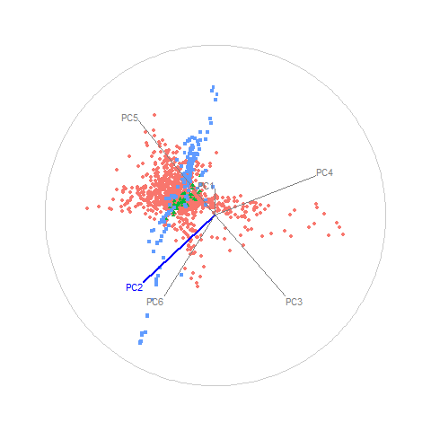

```{r, echo=FALSE, fig.cap="Animation of figure 8. Snapshots of a radial manual tour exploring the sensitivity PC2 to the structure of the DIS cluster, with color indicating experiment type: DIS HERA1+2 (green), dimuon SIDIS (purple), and charm SIDIS (orange). As contribution from PC2 is decreased, dimuon SIDIS becomes more distinguishable from the other two clusters (frames 10-14), indicating that in its absence PC2 is important."}

```
