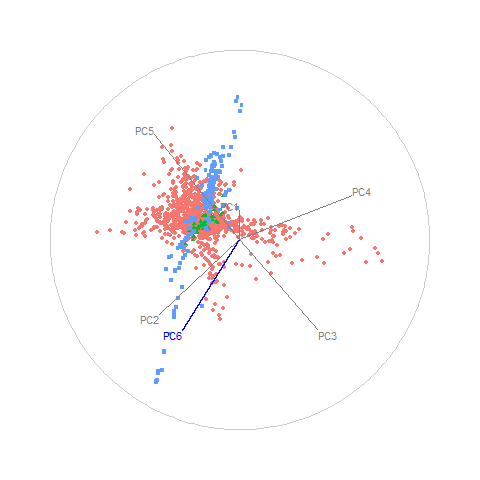

```{r, echo=FALSE, fig.cap="Animation of figure 7. Snapshots of a radial manual tour exploring the sensitivity PC6 has on the structure of the DIS cluster, with color indicating experiment type: DIS HERA1+2 (green), dimuon SIDIS (purple), and charm SIDIS (orange). DIS HERA1+2 is distributed in a cross-shaped plane, charm SIDIS occupies the center of this cross, and dimuon SIDIS is a linear cluster crossing DIS HERA1+2. As the contribution of PC6 is increased, DIS HERA1+2 becomes almost singular in one direction (frame 5), indicating that this experiment has very little variability in the direction of PC6."}

```
