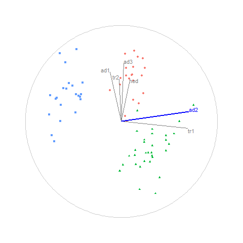

```{r, echo=FALSE, fig.cap="Animation of figure 4. Radial manual tour manipulating aede2 of standardized flea data. The axis for aede2 increases in contribution to the projection, from its initial value to 1, decreasing to 0 and then returning to the initial value. This effects the separation between the purple and green clusters. This shows that aede2 is important for distinguishing the purple species, because the separation disappears when aede2 is not contributing to the projection."}

```
