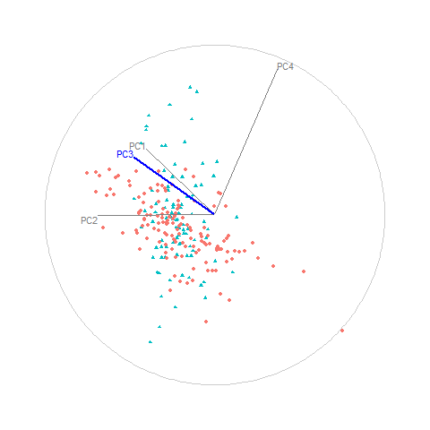

```{r, echo=FALSE, fig.cap="Animation of figure 6. Snapshots of a radial manual tour of PC3 within the jet cluster, with color indicating experiment type: ATLAS7new (green) and ATLAS7old (orange).  When the contribution from PC3 is changed there is little change to the structure of the two groups, suggesting that PC3 is not important for distinguishing the experiments."}

```
