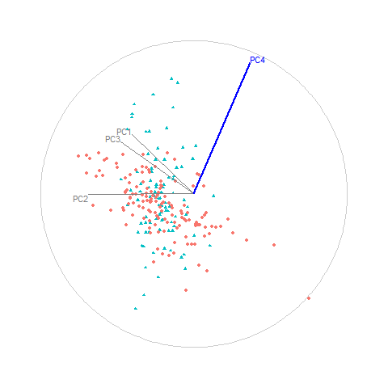

```{r, echo=FALSE, fig.cap="Animation of figure 5. Snapshots of a radial manual tour of PC4 within the jet cluster, with color indicating experiment type: ATLAS7new (green) and ATLAS7old (orange). When PC4 is removed from the projection (frame 10) there is little difference between the groups, suggesting that PC4 is important for distinguishing the experiments."}

```
